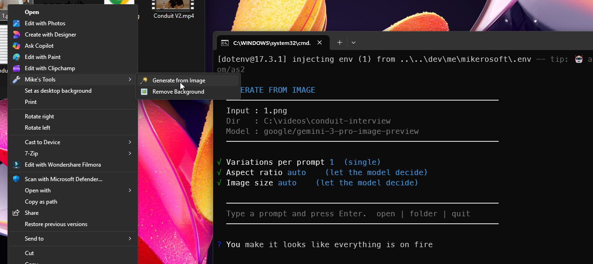

#  img-remix

Right-click an image, describe a change, and get a new one back

Windows · macOS

<!-- media: hero -->
<!--  -->
<!-- /media: hero -->


## What it is

This one's a little terminal chat for editing images with AI. You point it at an image, type what you want, and Gemini 3 Pro makes a new image from your picture and your prompt.

Each result is saved as a numbered file next to the original, so you can keep going and nothing gets overwritten. There's also a one-shot mode if you just want a single result without the chat.

Previously called `generate-from-image`.

The intro describes the original model. The current code tries Gemini 3.1 Flash first, then other Gemini image models if it gets rate-limited. Numbering starts at 001 each time you launch it, so move any earlier results you want to keep before starting another session.



## Get it

Paste this into your AI coding agent (Claude Code, Codex, Cursor...):

> Clone https://github.com/mikecann/img-remix and make it my own. It's one of Mike
> Cann's personal tools, so read the README first, change anything specific to his
> setup to suit mine, then help me get it running.

### Or set it up by hand

You need Git, [Bun](https://bun.sh), and an [OpenRouter API key](https://openrouter.ai/keys). On Windows you can install Bun with `winget install oven-sh.bun`. The macOS launcher also uses Python 3 to resolve symlinks. Image generation sends your image and prompt to OpenRouter and uses your account's credits.

```sh
git clone https://github.com/mikecann/img-remix.git
cd img-remix
```

Copy `.env.example` to `.env` in this folder and fill in `OPENROUTER_API_KEY`. An environment variable works too and takes precedence over `.env`.

On Windows, run from PowerShell:

```powershell
Copy-Item .env.example .env
# Edit .env to add your key, then:
powershell -ExecutionPolicy Bypass -File .\install.ps1
```

The installer runs `deps.ps1`, writes ASCII launchers into `C:\dev\tools`, and registers **Mike's Tools > img-remix** for images in Explorer. It offers to add the launcher directory to your User PATH. Open a new terminal afterwards. Use `-ToolsDir` for a different launcher directory or `-SkipDeps` if you've already run `bun install --frozen-lockfile`.

On macOS:

```sh
cp .env.example .env
# Edit .env to add your key, then:
bash install.sh --with-bun-install
```

This links `img-remix` into `~/.local/bin`. Add that directory to PATH if needed:

```sh
export PATH="$HOME/.local/bin:$PATH"
```

Put that line in `~/.zshrc` to keep it for new terminals. You can pass another destination, for example `bash install.sh /path/to/bin --with-bun-install`. Keep the clone in place because the launchers point at its files. If you move it, remove the old launcher and rerun the installer.

## Using it

On Windows, right-click an image and choose **Mike's Tools > img-remix**. On Windows 11, click **Show more options** first.

From a terminal on either platform:

```sh
img-remix "photo.png"
```

Pick the number of variations, aspect ratio and size, then type a prompt. Each prompt edits the original input image, rather than the last result. Variations run sequentially and are saved beside the source as `photo-generated-001.png`, `photo-generated-002.png`, and so on.

For one shot without the interactive prompts:

```sh
img-remix "photo.png" --prompt "Make the sky blue" --variations 1 --aspect auto --size auto
```

You can also run `bun run index.ts "photo.png" --prompt "Make the sky blue"` without installing a launcher.

## Settings and commands

| Input | Action |
| --- | --- |
| Any prompt | Generate from the original image |
| `open` | Open the last result in your default viewer |
| `folder` | Open the output directory in Explorer or Finder |
| `quit`, `exit`, `q`, `:q` | Exit |

Generation settings are chosen at startup and kept for the session. Restart to change them. In one-shot mode, use these flags:

| Flag | Values |
| --- | --- |
| `--variations` | `1`, `2`, `3`, `4` (default `1`) |
| `--aspect` | `auto`, `1:1`, `16:9`, `9:16`, `4:3`, `3:4`, `3:2`, `2:3`, `4:5`, `5:4`, `21:9` |
| `--size` | `auto`, `1K`, `2K`, `4K` |

The default aspect and size are `auto`, which lets the model decide.

## Models

The `MODELS` list in `index.ts` currently tries:

1. `google/gemini-3.1-flash-image-preview`
2. `google/gemini-2.5-flash-image`
3. `google/gemini-3-pro-image-preview`

Only rate-limit errors (`429`) trigger the next model. Edit that list if you want to change the order or model names.

## Troubleshooting and removal

If the API key is missing, check `.env` beside `index.ts`. The CLI loads it from the clone, even when you run from an image's folder. If a model fails, the terminal prints the error. One-shot mode currently exits with code 0 even after a generation error, so check for the saved file before treating a run as successful.

Windows removal: `powershell -ExecutionPolicy Bypass -File .\uninstall.ps1`. Pass the same `-ToolsDir` if you installed to a custom directory. This removes the tool's launchers, converted icon and Explorer verbs, and leaves other tools and the shared submenu alone. It keeps your clone, `.env`, and PATH entry.

macOS removal: `bash uninstall.sh`, or `bash uninstall.sh /path/to/bin` for a custom destination. It only removes a symlink pointing at this clone.

## Development

```sh
bun install --frozen-lockfile
bun test
bunx tsc --noEmit
pwsh -NoProfile -File tests/parse-powershell.ps1
bash -n img-remix install.sh uninstall.sh tests/mac-install.test.sh
bash tests/mac-install.test.sh
```

The regression test uses a mocked API response and needs no secrets. CI runs tests and type checks on macOS and Windows, parses every PowerShell script, checks shell syntax, and tests installation and removal on both platforms. The Windows installer smoke test runs only on an ephemeral runner.

## More tools

I keep my other tools at [mikerosoft.app](https://mikerosoft.app).

MIT licensed.
